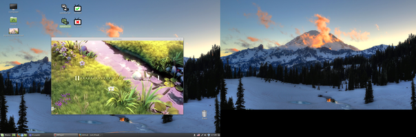

*************
theater-setup
*************

.. contents:: `Table Of Contents`
    :depth: 2

Intro
-----

A set of simple scripts, config files, data and instructions
for transforming a Linux PC (possibly with a TV) into
a clickable environment for playing videos.

Note that the setup is bound to the author's computer and some
(possibly small) changes need to be made in order to make it
operational on other machines.

A configuration is recommended to experienced ``UNIX`` users only.

Features
========
* easy to use for a common computer users
* clickable redirecting of sound output between a computer and a TV
* clickable turning of TV connection on/off
* automatic subtitle loading

Typical use case
================
You have a ``Linux``-based computer connected to a TV and you need
to setup a simple environment that can be used by people without
an IT background.

These common users may then redirect a video output to the TV screen
by mouse clicking only and use a keypad to control it from a distance.

Description
-----------

Scripts
=======
* tv [start|stop] -- turn a HDMI-connected tv on/off by using xrandr
* speaker [pc|tv] -- switch sound output between a PC and a TV speakers
* submplay VIDEO_FILE -- wrapper for mplayer with automatic subtitle lookout

Icons
=====
* icons are to be put on user's desktop to allow clickable management of tv and speakers
* all icons just invoke ``tv`` or ``speaker`` script

Installation
------------

Dependencies
============

* xrandr
* mplayer
* pulseaudio

Tree structure
==============

This tree shows where the distributed files should end up.

.. code:: bash

  ├── home 
      └── $USER
          └── .mplayer
              ├── config
              └── input.conf
          └── Desktop
              ├── speaker-tv.desktop
              ├── speaker-pc.desktop
              ├── tv-start.desktop
              └── tv-stop.desktop
  ├── usr
      └── local
          └── bin
              ├── tv
              ├── speaker
              └── submplay
      └── share
          └── icons
              └── hicolor
                  └── {16x16,32x32,48x48,64x64,96x96,128x128,192x192,256x256,512x512}
                      ├── theater-setup-speaker-pc.png
                      ├── theater-setup-speaker-tv.png
                      ├── theater-setup-tv-start.png
                      └── theater-setup-tv-stop.png

Installation steps
==================

Install
#######

* there is no single ``make install`` rule because the installation
  is too machine-specific
* paths are relative to the project's root directory
* make sure you backup a relevant files so that nothing gets overwritten

.. code:: bash

  # install the essential scripts, a default path is ``/usr/local/bin``
  $ make install-scripts # invoke under root

.. code:: bash

  # install mplayer configuration file (possibly backing the existing config up)
  $ install -b --suffix=".old" -D -m 644 mplayer/{config-pc,config-tv,input.conf} "$HOME"/.mplayer/

.. code:: bash

  # optionally install the desktop entries to the Desktop
  $ install -m 744 shortcuts/{speaker-pc,speaker-tv,tv-start,tv-stop}.desktop "$HOME"/Desktop

.. code:: bash

  # optionally install the icons for the desktop entries
  # invoke under root
  $ for dir in "16x16" "32x32" "48x48" "64x64" "96x96" "128x128" "192x192" "256x256" "512x512"; do \
      install -D -m 644 icons/${dir}/theater-setup-{speaker-pc,speaker-tv,tv-stop,tv-start}.png "/usr/share/icons/hicolor/${dir}/apps/"; \
    done;

Configure
#########
Now when the installed files have the right path structure, make a changes
so that the scripts and configuration files suite your machine, especially:

* tv -- modify options of ``xrandr``
* .mplayer/config
* speaker -- assign ``$tv_sink`` and ``$pc_sink`` variables

Tweak display manager
#####################
It is often convenient to have a TV connection turned off
before login and after logout. This can be done by adding
these commands into a corresponding pre-login and logout scripts.

.. code:: bash

  tv stop
  speaker pc

In case of ``GDM`` (``GNOME Display Manager``) these are the ``/etc/gdm/Init/Default``
and the ``/etc/gdm/PostSession/Default`` files.

Associate
#########
Associate some video extensions (avi, ogv, mp4, ...) with the ``submplay`` script.

Play
####
Prepare some video files with a corresponding subtitles and test a setup environment.

TODO
----
* create a wallpaper(s) with instructions and ``mplayer`` shortcuts on it
* create a printable sheet with shortcuts

License
-------
GPLv3

Authors
-------
* S\. Vlcek <svlc at inventati.org>
